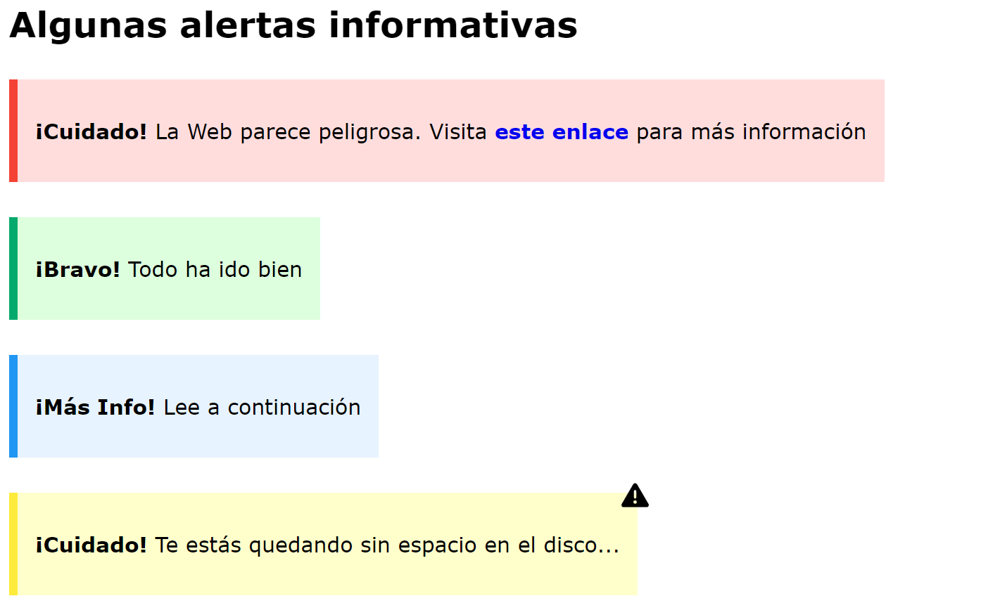

# UF1841

Cada apartado conseguido otorga un punto de la nota final. Los 6 primeros apartados son sencillos. Además, si atribuyes adecuadamente las propiedades CSS a cada selector, lo puedes hacer muy rápido. No hace falta añadir ningún tag nuevo HTML, salvo para el apartado 1 y 4.

1. Enlazar adecuadamente el fichero **style.css** al _index.html_
2. Cambiar el tipo de letra de todo el _body_ a Verdana
3. En el primer párrafo, crea un enlace para el texto _este enlace_ que al hacer clic encima, nos lleve a la página "https://support.google.com/faqs/answer/2952493?hl=es" en **una nueva pestaña del navegador**
4. Utiliza una etiqueta semántica adecuada para darle **importancia** a la palabra entre exclamaciones de cada texto. Ejemplo: <etiqueta>¡Cuidado!<etiqueta>
5. Cada cajita tiene el color de fondo esperado
6. Cambia el _font size_ de cada cajita a **1.2rem**
6. Se utiliza una propiedad CSS adecuada para separar el contenido del borde de cada texto (NO uses la propiedad _height_ para ello)
7. Se utiliza una propiedad CSS adecuada para establecer un **borde izquierdo** de **8px, sólido** en cada caja, con el color de borde esperado.
9. Las cajitas estan separadas la misma distancia unas de otras de forma apreciable
10. DIFÍCIL. Sitúa el icono de _warning.svg_ en la parte superior derecha de la cajita amarilla. Seguramente debas añadir una nueva regla CSS.
## Colores usados

### Rojo
- color de fondo: #ffdddd;
- color del borde: #f44336

### Verde
- color de fondo: #ddffdd
- color del borde: #04AA6D;

### Azul
- color de fondo: #e7f3fe;
- color del borde: #2196F3

### Amarillo
- color de fondo: #ffffcc;
- color del borde: #ffeb3b;

## Diseño Esperado

